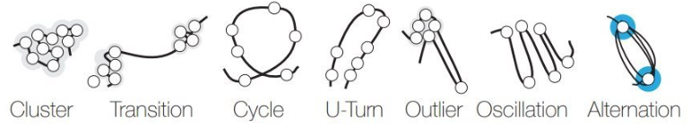

# Analyzing Logs of Large-Scale Software Systems using Time Curves Visualization

This repository contains the supplementary data mentioned in the paper "Analyzing Logs 
of Large-Scale Software Systems using Time Curves Visualization". In addition, GIF animations
of the static *Time Curves* in the paper are provided and can be played in your browser.

## Table of contents

1. [Animated Time Curves](#animated-time-curves)
    - [Spark Structured Streaming](#spark-structured-streaming)
    - [Apache Flink](#apache-flink)
    - [Kafka Streams](#kafka-streams)
    - [Zookeeper dataset](#zookeeper-dataset)
    - [Multiple curve analysis](#multiple-curve-analysis)
2. [Glossary](#glossary)
3. [Logs source in each of the Stream Processing Frameworks](#logs-source-in-each-of-the-stream-processing-frameworks)
4. [Example logs found in each stage of the Stream Processing Frameworks](#example-logs-found-in-each-stage-of-the-stream-processing-frameworks)
5. [Grouping events in the Stream Processing Frameworks experiment](#grouping-events-in-the-stream-processing-frameworks-experiment)
6. [Correlation of the Stream Processing Frameworks with throughput](#correlation-of-the-stream-processing-frameworks-with-throughput)
7. [Hardware setup](#hardware-setup)
8. [Proofs for the distance function being a semimetric](#proofs-for-the-distance-function-being-a-semimetric)
9. [Counterexample that the proposed distance is not a metric](#counterexample-that-the-proposed-distance-is-not-a-metric)
10. [Optimizations to the distance computation](#optimizations-to-the-distance-computation)
11. [Representing time within Time Curves](#representing-time-within-time-curves)
12. [Manual analysis of the Zookeeper log file](#manual-analysis-of-the-zookeeper-log-file)
13. [Large Language Model summarization](#large-language-model-summarization)
    - [Query about single checkpoint summarization in Label C](#query-about-single-checkpoint-summarization-in-label-c)
    - [Query about single checkpoint summarization in Label D](#query-about-single-checkpoint-summarization-in-label-d)
    - [Query about pairwise comparison between checkpoints in Label D](#query-about-pairwise-comparison-between-checkpoints-in-label-d)
    - [Query about pairwise comparison between Label C and E](#query-about-pairwise-comparison-between-label-c-and-e)
14. [Log datasets](#log-datasets)
15. [Citing](#citing)
16. [References](#references)

## Animated Time Curves

In this section, the animated versions of each of the presented Time
Curve analysis are shown. Each curve begins fully drawn. Afterwards, it
is played from start to end.

### Spark Structured Streaming


### Apache Flink


### Kafka Streams


### Zookeeper dataset


### Multiple curve analysis


## Glossary

The following terms are used throughout the main manuscript. Definitions are provided 
in the context used in the manuscript, rather than their formal definitions.

- Log: String represented text message usually consisting of a timestamp and a payload. 
- Template: A string representation of a set of logs which are very close semantically and typically differ only in syntactical elements, such as host names or service ID's. 
- Distance: A number that quantifies how far away two objects are, such as for example, points in a 2D projection. Similarly, the notion of distance may be extended to be a "metric distance", where formal mathematical constraints must be satisfied (e.g. triangle inequality). 
- Semimetric: A semimetric is a distance metric that does not satisfy the triangle inequality but does satisfy all other constraints (separation, positivity, symmetry). 
- Similarity measure: Inversely to a distance, it quantifies how close two objects are. 
- Time Curve: A 2D projection of a set of data points which includes information about time and similarity between them. 
- System: Any computer machine that can provide logging or tracing about the execution that is being performed. 
- Event: A set of consecutive logs of a system which are related by, e.g., process, cause, etc.; in other words, a snapshot over small timeframe of a system based on the logging.  
- Checkpoint: Representation of an event, which keeps its timestamp and corresponds to a data point in a Time Curve but replaces the set of original logs with a set of templates. 
- Evolution of the system: Chronological sequence of events representing changes in the behavior of the system over time.  
- Pattern: A set of contiguous checkpoints visually representing a particular evolution of the system, such as cycles, clusters, etc.

Example visual patterns of interest in Time Curves can be found below:



## Logs source in each of the Stream Processing Frameworks

The following sources were used for collection of logs in the Stream
Processing frameworks, namely (1) the Spark driver for Spark Structured
Streaming, (2) the consumer group worker that corresponds to the
partition leader in Kafka Streams and (3) the job manager in Apache
Flink.

## Example logs found in each stage of the Stream Processing Frameworks

The following table contains example logs that were found in each of the
identified stages of interest in the stream processing framework
analysis in Section IV-A. This includes startup, failure, recovery and
shutdown.

Note that for Kafka Streams there are no indistinguishable logs for the
fault recovery besides what can be considered normal processing logging
statements.
```
+-----------------+-----------------+-----------------+-----------------+
| Stage           | Spark Str.      | Apache Flink    | Kafka Streams   |
|                 | Streaming       |                 |                 |
+=================+=================+=================+=================+
| Startup         | INFO            | INFO ...        | INFO            |
|                 | SparkContext OS | RESOURCE PARAMS | AppInfoParser   |
|                 | info Linux 5    | ... logs jvm    | Kafka version:  |
|                 | ... x86 64      | params          | 3.5.0           |
|                 | amd64           | Xmx1530082096   |                 |
+-----------------+-----------------+-----------------+-----------------+
| Failure         | ERROR ... Lost  | INFO ...        | INFO ...        |
|                 | executor <*>    | <*> switched    | Revoked         |
|                 | Not receiving   | from RUNNING to | partitions      |
|                 | heartbeat ...   | FAILED on flink |                 |
|                 |                 | ...             |                 |
+-----------------+-----------------+-----------------+-----------------+
| Fault recovery  | INFO ...        | INFO ...        | INFO Processed  |
|                 | Registered      | Deploying       | <*> total       |
|                 |                 | Source ... to   | records         |
|                 | executor with   | flink-taskmanag |                 |
|                 | ID <*>          | er              |                 |
|                 |                 | ...             |                 |
+-----------------+-----------------+-----------------+-----------------+
| Shutdown        | WARN ...        | INFO ...        | INFO Processed  |
|                 | Disconnected    | Shutting down   | <*> total       |
|                 | from Spark      | remote daemon   | records         |
|                 | cluster! ...    |                 |                 |
+-----------------+-----------------+-----------------+-----------------+
```
Table 1. Example of log records found in the stages corresponding to
startup, failure injection, fault recovery and shutdown in the three
different Stream Processing frameworks. Note that some messages have
been reduced in size for clarity.

## Grouping events in the Stream Processing Frameworks experiment

This section includes additional details about the grouping of events
given the set of parameters shown in Table 1. Parameters marked with `*`
imply that they are *not* default.
```
+-----------------+-----------------+-----------------+-----------------+
|                 | Spark Str.      | Apache Flink    | Kafka Streams   |
|                 | Stream.         |                 |                 |
+=================+=================+=================+=================+
| Clustering      | Drain, tree     | Drain, tree     | Drain, tree     |
| Algorithm       | depth=8         | depth=8         | depth=8         |
+-----------------+-----------------+-----------------+-----------------+
| Clustering      | 0.4             | 0.4             | 0.4             |
| similarity      |                 |                 |                 |
+-----------------+-----------------+-----------------+-----------------+
| Number of       | Desired = 25,   | Desired = 25,   | Desired = 15*,  |
| checkpoints     | resulted in 20  | resulted in 62  | resulted in 15  |
+-----------------+-----------------+-----------------+-----------------+
| Top k-gaps to   | 10              | 10              | 10              |
| use             |                 |                 |                 |
+-----------------+-----------------+-----------------+-----------------+
| Relative window | 0.25            | 0.25            | 0.25            |
| size            |                 |                 |                 |
+-----------------+-----------------+-----------------+-----------------+
| Conv. Window    | exp             | exp             | exp             |
+-----------------+-----------------+-----------------+-----------------+
| Window thresh.  | 1.01            | 1.01            | 1.01            |
+-----------------+-----------------+-----------------+-----------------+
| Min-max ratio   | 0.05            | 0.05            | 0.001*          |
+-----------------+-----------------+-----------------+-----------------+
```
Table 2. Parameters used for the automatic grouping of events in the
Stream Processing experiment.

The following plots explain the grouping decisions for each framework.


Figure 1. Grouping details in Spark Structured Streaming.

In Spark Structured Streaming, the events align quite well with the 
injected failures. Notice that in some ocassions the split takes place
because of either a severity change (which perfectly aligns with the
injected failure) or as a result of a large time gap. Notice too that
if the number of top k-gaps was reduced, the severity change would still
group the events around the failures, however, currently the time gap
event trigger occurs shortly before the severity level change, therefore
instead of splitting into two different events, they are grouped into a
single one. All event grouping parameters are left default for Spark.


Figure 2. Grouping details in Apache Flink.

In the case of Flink, we have many more events after every error because
of the changes in severity level. This is not a problem because those
checkpoints are almost identical and get put into halo clusters in the
corresponding Time Curves. After the repetitive succession of errors, the next 
event is generated by the largest time gap, showing that the system is 
processing normally. All event grouping parameters are left default for Flink.


Figure 3. Grouping details in Kafka Streams.

The case of Kafka Streams is more complicated. As can be seen, up until the
log number ~3,250, the reported severity level errors are not as a result of
the injected failures. In fact, the failures are reported as standard `INFO`
messages. This means that all the information corresponding to the failures is
condensed exclusively into the last ~1,000 logs and therefore all the grouping
occurs because of time gaps (between the 12 minute marks) rather than because of
error messages or number of logs. This is the reason why the default grouping
had to be changed from default, since no proper logging was available. As
stated in the paper, this is partially due to the framework and the selection
of the logging source (worker 0).

## Correlation of the Stream Processing Frameworks with throughput

This section shows how the throughput (in terms of messages processed
per second) reported from the Stream Processing Frameworks correlates
with the reported events of failure and recovery as reported in the main
manuscript.


Figure 4. Throughput measured as the number of processed records per
second in each of the Stream Processing Frameworks.

As can be seen in Figure 4, all frameworks exhibit a temporary decrease
in throughput when the failures are injected (represented as vertical
bars after every 12 minute mark). This aligns especially with the
severity level changes and the time gaps observed in Spark Structured
Streaming and Apache Flink. In the case of Kafka Streams, only the time
gaps result in event splits due to the framework not reporting any
severity change. These can be seen at the end of Figure 3, after the
initial \~3,250 log records.

## Hardware setup

The scalability section of the manuscript was run on a local machine
with an Intel Core i9-11950H with disabled turbo boost running at 2.60
GHz and 64 GB of memory. They were run on WSL with Ubuntu version 22,
Java 17 and Python 3.8.

## Proofs for the distance function being a semimetric
The proposed distance function is formally not a metric, since a metric needs to satisfy the following properties for any elements $x$ and $y$ from the set:
1. **Non-negativity**: $dist(x, y) \geq 0$.
2. **Identity of indiscernibles**: $dist(x, y) = 0 \iff x = y$.
3. **Symmetry**:  $dist(x, y) = dist(y, x)$.
4. **Triangle inequality**: $dist(x, z) \leq dist(x, y) + dist(y, z)$.

If only the first 3 properties are satisfied, but the triangular inequality
is violated, then $dist$ is a semimetric. We will now prove that $D(\cdot,\cdot)$ is indeed a semimetric over the set of all possible checkpoints.

1. Since all terms are non-negative, so is the $D(\cdot, \cdot)$, *i.e.*:
    $$D'(x,y) =  \frac{1}{m} \sum_{i=0}^{m} \min_{j} d(y_i, x_j) \overset{d(x_i,y_j) \geq 0}{\geq} 0.$$
    $$D(x,y) {\geq} \frac{\log_2 |x| \cdot 0 + \log_2 |y| \cdot 0}{\log_2 |x| + \log_2 |y|} = 0.$$

2. Identity of indiscernibles can be verified as follows:
        $$\begin{align*}
             D(x,y) = 0 &\iff D'(x,y) = D'(y,x) = 0 \\
             &\iff \left\{
                 \begin{array}{ll}
                     \forall i \min_{j = 0,\dots, n-1} &d(x_i, y_j) = 0, \\
                     \forall j \min_{i = 0,\dots, m-1} &d(y_j, x_i) = 0. \\
                 \end{array} \right. \\ 
             &\iff \forall i \ \  x_i \in y \text{ and }  \forall j \ \  y_j \in x \\
             &\iff x \subseteq y \text{ and } y \subseteq x \\
             &\iff x = y.
         \end{align*} $$
3. Symmetry holds by design, because $D(x,y)$ involves both $D'(x,y)$ and $D'(y,x)$.
4. The triangular inequality is the only violation of metric properties. This can be seen with nested checkpoints (a counterexample is available in section [Counterexample that the proposed distance is not a metric](#counterexample-that-the-proposed-distance-is-not-a-metric) ).

## Counterexample that the proposed distance is not a metric

The following example proves that the checkpoint distance is not a
metric (rather a semimetric) due to violating the triangle inequality.

Let $x := {x_0, x_1, x_2, x_3, x_4, x_5, x_6, x_7} := A$, $y := {x_0, x_1}$, $z := {x_0, x_1, x_2, x_3}$, and the curve of 3 points $P := {x,y,z}$.

Then $|A| = |x| = 8$ (8 unique templates, all are in $x$), $|y| = 2$, $|z| = 4$ and $|P| = 3$ (in total 3 points).

Assume we have written down 24 different characters, and split them into templates $x_i$'s as follows:
Put (concatenate in any order) first 9 characters into $x_2$, next 9 into $x_3$, each of the rest 6 characters into a separate template to get $|x_0|=|x_1|=|x_4|=|x_5|=|x_6|=|x_7|=1$. Now add the $x_1$ character to $x_2$ and $x_3$, so that $|x_2| = |x_3| = 10$, then:
$d(x_2, x_1) = d(x_1, x_2) = d(x_1, x_3) = d(x_3, x_1) = \frac{1}{10}$
and all other $d(x_i, x_j) = 1$. Moreover $x, y, z$ are nested:

$y \subset z \subset x \implies D’(y,z) = D’(y,x) = D’(z,x) = 0.$

$D’(x,y) = \frac{1}{8} \sum_{i=0}^{7} \min_{j = 0,1} d(x_i, y_j)$

$= \frac{1}{8} (0 + 0 + \frac{1}{10} + \frac{1}{10} + 1 + 1 + 1 + 1) = \frac{21}{40},$

$D’(x,z) = \frac{1}{8} \sum_{i=0}^{7} \min_{j = 0,1,2,3} d(x_i, z_j)$

$= \frac{1}{8} (0 + 0 + 0 + 0 + 1 + 1 + 1 + 1) = \frac{1}{2},$

$D’(z,y) = \frac{1}{4} \sum_{i=0}^{3} \min_{j = 0,1} d(z_i, y_j)$

$= \frac{1}{4} (0 + 0 + \frac{1}{10} + \frac{1}{10}) = \frac{1}{20}.$

$D(x,y) = \frac{\frac{21}{40}\log_2 8 + 0\log_2 2}{\log_2 (8 \cdot 2)} = \frac{63}{160} = 0.39375,$

$D(x,z) = \frac{\frac{1}{2}\log_2 8 + 0\log_2 4}{\log_2 (8 \cdot 4)} = \frac{\frac{1}{2} \cdot 3}{5} = 0.3,$

$D(z,y) = \frac{\frac{1}{20}\log_2 4 + 0\log_2 2}{\log_2 (4 \cdot 2)} = \frac{\frac{1}{20} \cdot 2}{3} = \frac{1}{30}.$

We finally arrived at the violation of triangular inequality:
$0.39375 = D(x,y) > D(x,z) + D(z,y) = \frac{3}{10} + \frac{1}{30} = \frac{1}{3}.$

This concludes that $D(\cdot,\cdot)$ is not a metric, since it violates triangular inequality, but it is a semi-metric by definition.

## Optimizations to the distance computation

The proposed semimetric requires significant computation. It is
comprised of multiple quadratic terms, including (1) the Levenshtein
distance itself, which is quadratic in the length of the strings, (2)
the comparison between two checkpoints is also quadratic, since it
requires to compare all templates in one checkpoint to all templates in
the other and finally (3) the comparison of all checkpoints, where a
distance matrix between checkpoints is required for the projection, thus
also resulting in a quadratic term. It can be seen that naively
computing the distance aggregation can become unfeasible quickly.
Therefore, a series of computational optimizations are used to lower the
complexity of the approach.

Let us first define the output of the aggregation of all distances,
which is a symmetric matrix of pairwise distances between any two
checkpoints noted as $D_{M} \in \mathbb{R}^{N \times N}$

and defined entry-wise as follows:

$$\forall i,j \in \{ 0,1,\ldots, \mid P \mid - 1\} D_{M}\lbrack i\rbrack\lbrack j\rbrack = D(P_{i},P_{j}).$$

Given $D( \cdot , \cdot)$ is a normalized semimetric, we have that
$D_{M} \in \lbrack 0,1\rbrack^{N \times N}$, is symmetric and its
diagonal entries are all zeros, which implies that only strictly upper
(or lower) triangular part of matrix needs to be calculated.

The first measure is to pre-compute all pairwise distances between
unique templates. This translates into avoiding recomputation overhead
since there is a significant overlap of templates between checkpoints,
thus resulting in the complexity being nearly independent from the
number of checkpoints. To store distances between individual log
templates, let us define a matrix and denote it
$d_{M} \in (\lbrack 0,1\rbrack)^{\mid A \mid \times \mid A \mid}$, where
$\forall i,j\, \in \{ 0,1,\ldots,\mid A\mid - 1 \}\, d_{M}\lbrack i \rbrack\lbrack j \rbrack = d( A_{i},A_{j})$.

Clearly only strictly upper (or lower) triangular part of matrix needs
to be computed explicitly since
$d_{M}\lbrack i\rbrack\lbrack j\rbrack = d(A_{i},A_{j}) = d(A_{j},A_{i}) = d_{M}\lbrack j\rbrack\lbrack i\rbrack.$

The second measure concerns the observation that many pairs of templates
appear only on specific checkpoints. This is a natural consequence of
the logging systems. Consider the example where an error appears only in
a single checkpoint. Then it is likely that the error will produce a
chain of log records related to it. When clustered, this will result in
multiple templates being present only in this checkpoint, and therefore
they cannot be compared together since checkpoints are compared only
against other checkpoints and not themselves. For this purpose, the
entries of $d_{M}$ are computed on demand, thus avoiding unnecessary
comparisons as well.

A third measure concerns the Levenshtein distance directly. It is
possible to compute a lower bound for the Levenshtein distance based
simply on length difference of the templates. If two templates
significantly differ in length such estimate allows pruning further
computation of $d(x_{i},y_{j})$ in case the lower bound is larger than
the current minimum distance among pairs of templates with the current
one, i.e., for fixed $x_{i}$ $d(x_{i},y_{j}) > \min d(x_{i},y_{j})$
means that $d(x_{i},y_{j})$ will not change $D(x,y)$ due to min term in
Eq. 1 and therefore can be skipped.

In addition, in cases where there is a significant overlap between
templates in checkpoints, it may be possible to replace most of the
string comparisons by simple integer look-ups. This is achieved by
extending each template with a unique identifier, in a similar fashion
to hashing. However, hashing is not required since all templates are
guaranteed to be unique due to the clustering approach. And only a fast
identifier look-up is needed to check whether a given template is
present in a checkpoint.

Note that in total all these optimizations significantly lower the
complexity of the average case without introducing any errors to
$D_{M}$. Nevertheless, the worst-case scenario remains possible and for
such cases the runtime can be further reduced by applying heuristic
techniques which do in fact affect the result of $D_{M}$. Among others,
this includes e.g., fine-tuning the clustering parameters to result in
less templates, and in extreme cases, replacing the Levenshtein distance
altogether by a faster approximation such as the Q-gram distance.

## Representing time within Time Curves

Representing time is necessary for understanding the sequence of events
in a collection of logs. For visualizing the time dimension of the
system evolution we follow another Gestalt Perception Principles
\[1\] smooth curvature instead of straight lines to satisfy the
Low of Continuity, which also helps to avoid confusions when the graph
crosses itself (which is typical of recurrent processes), and color-time
relation to utilize the Low of Similarity, which clarifies the direction
of the evolution and allows to understand the flow of events in time on
a static graph.

In other words, time dimension in our Time Curves is represented in
different, but complementary ways. First of all, checkpoints are
connected in chronological order to form a continuous and smooth curve
(achieved via using spline ideas, check the original paper for the
details \[2\]). Secondly, color of the curve segments changes to
highlight the evolution of the system states over time, i.e. specified
color-scale correspond to relative time-scale, e.g. red to blue gradient
correspond to start to end of the observation period. And last
time-related feature is the thickness of the curve segments, which is
increased proportionally to the ratio of time interval between the
checkpoints and total time of observation.

While for some processes having an order of events in time is already
sufficient, for other observations estimates of interval between
checkpoints is necessary to analyse the system\'s behaviour. Meaning
that time relevance vary depending on the input. Therefore, *Time
Curves* provide control of how much the timeline is folded, which allows
users observe any state of the graph between curve-connected, purely
similarity-based scatter plot and a timeline (similarity is completely
ignored). We will refer to the process of transforming similarity
projection into a timeline as \"unfolding in time\" or simply
\"unfolding\" and it is performed via linear interpolation between point
coordinates obtained from projection algorithm and from constructing a
timeline, curvature is adjusted on the fly to preserve the smoothness
between connective segments.

## Manual analysis of the Zookeeper log file

The following section shows the manual analysis of the roughly \~75,000
logs contained in the Zookeeper dataset. Each row in Table 2 starts with
a timestamp which corresponds to the timestamp of the first log line to
which the description belongs to. The absolute number of logs included
in the description follows. Note that the Zookeeper dataset needs to be
sorted according to the timestamps in order to make sense. In addition,
also note that the analysis is coarse-grained but also finer whenever
new logs that did not appear before take place.
```
+-----------------------------------------------------------------------+
| 2015-07-29 17:41:41,536 Logs 1 to 13                                  |
|                                                                       |
| Startup process from Zookeeper, reading configuration, configuring    |
| quorum, data directory cleanup, quorum peer process starting (which   |
| is responsible for managing the zookeeper ensemble).                  |
+=======================================================================+
| 2015-07-29 17:41:41,692 Logs 14 to 44                                 |
|                                                                       |
| Election leader process. The server binds the port. The server myid=1 |
| enters the LOOKING state which means it is looking for a leader. The  |
| server proposes itself (0x0). It logs that there are connection       |
| issues to server 10.10.34.12 and 13. Finally receives a connection    |
| request from 10.10.34.12 showing that it is also on the looking       |
| state.                                                                |
+-----------------------------------------------------------------------+
| 2015-07-29 17:42:28,519 Logs 45 to 63                                 |
|                                                                       |
| Server transitions to the FOLLOWING state, meaning it found a Leader. |
| The server logs configuration and so on. The election process is      |
| finished and notified its length.                                     |
+-----------------------------------------------------------------------+
| 2015-07-29 17:42:28,588 Logs 64 to 105                                |
|                                                                       |
| Before anything significant, another election process starts. The     |
| server myid=2 starts LOOKING and in the end it starts LEADING, thus   |
| replacing myid=1.                                                     |
+-----------------------------------------------------------------------+
| 2015-07-29 17:42:30:418 Logs 106 to 203                               |
|                                                                       |
| Yet another election process starts with server myid=3 proposing      |
| itself, but there are connection problems, response notifications are |
| taking very long. Server 2 becomes the new leader eventually.         |
+-----------------------------------------------------------------------+
| 2015-07-29 17:46:17,171 Logs 204 to 3,582                             |
|                                                                       |
| Connection requests from followers to the leaders occur with errors   |
| all the time (connection request, then connection broken, then        |
| interrupting, then some GOODBYES). These happen intertwined with      |
| "Unexpected exception causing shutdown while socket still open".      |
+-----------------------------------------------------------------------+
| 2015-07-29 19:21:26,842 Logs 3,582 to 53,161                          |
|                                                                       |
| Connection requests are still failing but now without the unexpected  |
| exception. Simply being broken.                                       |
+-----------------------------------------------------------------------+
| 2015-07-29 19:37:24,535 Logs 53,162 to 53,206                         |
|                                                                       |
| Finally, connections from clients begin. Before it was all servers.   |
| Connections are established. New log files are created as well.       |
+-----------------------------------------------------------------------+
| 2015-07-29 19:37:27,211 Logs 53,206 to 53,218                         |
|                                                                       |
| Multiple errors from clients trying to create nodes which already     |
| exist (files). For example, "/home".                                  |
+-----------------------------------------------------------------------+
| 2015-07-29 19:48:31,603 Logs 53,219 to 53,312                         |
|                                                                       |
| Connection requests from clients along with first-time ever properly  |
| closing sockets (and end of stream exceptions).                       |
+-----------------------------------------------------------------------+
| 2015-07-29 19:52:16,000 Logs 53,341 to 53,541                         |
|                                                                       |
| First ever messages of expiring sessions from clients because of      |
| timeout. Messages about the processed session termination follow.     |
| They get intertwined with standard client connection requests and     |
| established sessions.                                                 |
+-----------------------------------------------------------------------+
| 2015-07-29 19:53:09,882 Logs 53,542 to 53,800                         |
|                                                                       |
| Follower has an exception and shuts down (server myid=3) (note that   |
| the leader is myid=2). It calls for shutdown and closes multiple      |
| connections of clients it had open. After it shuts down, it           |
| transitions to LOOKING to find the leader again. It also reads the    |
| snapshot to restore state. Multiple rounds of notifications take      |
| place for voting the new leader. Server myid=2 is the new leader. It  |
| was already leader, but since myid=3 had some problems, it triggered  |
| a new election. Meanwhile there are many client and server            |
| connections.                                                          |
+-----------------------------------------------------------------------+
| 2015-07-29 19:56:52,122 Logs 53,801 to 58,878                         |
|                                                                       |
| Standard sessions and connections are requested, established and      |
| finished (expiring and being closed as well). Some finish with the    |
| end of stream exception, but nothing significant. A node exists error |
| is also there.                                                        |
+-----------------------------------------------------------------------+
| 2015-07-30 17:40:45,765 Logs 58,879 to 58,945                         |
|                                                                       |
| Connection is lost with myid=1 from myid=2 and myid=3. Therefore, a   |
| new election is triggered. The severs are on the LOOKING state. The   |
| "Have smaller server identified" log appears for the first time. The  |
| new leader is myid=1.                                                 |
+-----------------------------------------------------------------------+
| 2015-07-30 17:49:00,254 Logs 58,945 to 59,044                         |
|                                                                       |
| Normal processing. Another exception when following leader from       |
| myid=3. New election triggered. Meanwhile everything normal.          |
+-----------------------------------------------------------------------+
| **\*All logs between 59,044 and 70,383\***                            |
|                                                                       |
| Now up until the end, multiple elections happen because there is      |
| always one server crashing every once in a while. Always intertwined  |
| with normal processing, but of less duration. Sometimes a new log     |
| file is also created -- this depends on epochs and so on.             |
+-----------------------------------------------------------------------+
| 2015-08-24 15:26:54,671 Logs 70,383 to 73,993                         |
|                                                                       |
| After a lot of the previously described, a new election is initiated  |
| by myid=1, but this one is flawed. The server myid=1 is complaining   |
| for long about not being able to open a connection to myid=2 and      |
| myid=3. This lasts for long until finally elections are resolved and  |
| the new leader is myid=2.                                             |
+-----------------------------------------------------------------------+
| 2015-08-25 08:03:15,876 Logs 73,993 to end (74,380)                   |
|                                                                       |
| A couple elections more take place in a similar fashion, but no       |
| connection errors between servers. There is no shutdown or anything   |
| of similar nature at the end.                                         |
+-----------------------------------------------------------------------+
```
Snippet 1. Manual analysis of the Zookeeper log collection.

## Large Language Model summarization

In this section, a general Large Language Model (LLM) is used to further
summarize and compare the logging information contained within
checkpoints in the Time Curve analysis. While fine-tuning a custom Small
Language Model is intended for future work, we show that a general LLM
without any prior training or prompts is able to help with the
summarization. This is the case due to these large models (such as GPT 4
\[3\]) being trained on large corpus of text which typically
include logs from the analysed datasets (e.g., Flink or Zookeeper).

The interaction with Microsoft Copilot used for generating the answers
in Section 4-B is recorded below. Quoted answers in the paper are
highlighted in dark red.

### Query about single checkpoint summarization in Label C
```
+-----------------------------------------------------------------------+
|                                                                       |
| Can you summarize for me the following templates which correspond to  |
| logs from an apache zookeeper service? In particular, what is         |
| happening in the system?                                              |
|                                                                       |
| \- ERROR \<\*\> - Unexpected exception causing shutdown while sock    |
| still open                                                            |
|                                                                       |
| \- INFO \<\*\> - \<\*\>                                               |
|                                                                       |
| \- INFO \<\*\> - \<\*\> - LEADER ELECTION TOOK - \<\*\>               |
|                                                                       |
| \- INFO \<\*\> - \<\*\> \<\*\>                                        |
|                                                                       |
| \- INFO \<\*\> - \<\*\> \<\*\> to \<\*\>                              |
|                                                                       |
| \- INFO \<\*\> - \<\*\> to \<\*\> \<\*\>                              |
|                                                                       |
| \- INFO \<\*\> - Client attempting to \<\*\> \<\*\> \<\*\> at \<\*\>  |
|                                                                       |
| \- INFO \<\*\> - Closed socket connection for client \<\*\> which had |
| sessionid \<\*\>                                                      |
|                                                                       |
| \- INFO \<\*\> - Created server with tickTime 2000 minSessionTimeout  |
| 4000 maxSessionTimeout 40000 datadir /var/lib/zookeeper/version-2     |
| snapdir /var/lib/zookeeper/version-2                                  |
|                                                                       |
| \- INFO \<\*\> - Creating new log file: \<\*\>                        |
|                                                                       |
| \- INFO \<\*\> - Established session \<\*\> with negotiated timeout   |
| \<\*\> for client \<\*\>                                              |
|                                                                       |
| \- INFO \<\*\> - Follower sid: \<\*\> : info : \<\*\>                 |
|                                                                       |
| \- INFO \<\*\> - Getting a diff from the leader \<\*\>                |
|                                                                       |
| \- INFO \<\*\> - Have smaller server identifier, so dropping the      |
| connection: \<\*\> \<\*\>                                             |
|                                                                       |
| \- INFO \<\*\> - New election. My id = \<\*\> proposed \<\*\>         |
|                                                                       |
| \- INFO \<\*\> - Notification: \<\*\> (n.leader), \<\*\> (n.zxid),    |
| \<\*\> (n.round), \<\*\> (n.state), \<\*\> (n.sid), \<\*\>            |
| (n.peerEPoch), \<\*\> (my state)                                      |
|                                                                       |
| \- INFO \<\*\> - Reading snapshot \<\*\>                              |
|                                                                       |
| \- INFO \<\*\> - Received connection request \<\*\>                   |
|                                                                       |
| \- INFO \<\*\> - Server environment:java.vendor=Oracle Corporation    |
|                                                                       |
| \- INFO \<\*\> - Server environment:zookeeper.version=3.4.5\--1,      |
| built on 06/10/2013 17:26 GMT                                         |
|                                                                       |
| \- INFO \<\*\> - Synchronizing with Follower sid: \<\*\> \<\*\>       |
| \<\*\> \<\*\>                                                         |
|                                                                       |
| \- INFO \<\*\> - TCP NoDelay set to: true                             |
|                                                                       |
| \- INFO \<\*\> cport:-1)::PrepRequestProcessor\@476\] - Processed     |
| session termination for sessionid: \<\*\>                             |
|                                                                       |
| \- INFO                                                               |
| \[NIOServerCxn.Factory:0.0.0.0/0.0.0.0:2181:NIOServerCnxnFactory\@197 |
| \]                                                                    |
| - Accepted socket connection from \<\*\>                              |
|                                                                       |
| \- INFO \[SessionTracker:ZooKeeperServer\@325\] - Expiring session    |
| \<\*\> timeout of \<\*\> exceeded                                     |
|                                                                       |
| \- INFO \[Thread-1:QuorumCnxManager\$Listener\@486\] - My election    |
| bind port: 0.0.0.0/0.0.0.0:3888                                       |
|                                                                       |
| \- INFO \[main:DatadirCleanupManager\@101\] - Purge task is not       |
| scheduled.                                                            |
|                                                                       |
| \- INFO \[main:QuorumPeerConfig\@101\] - Reading configuration from:  |
| /etc/zookeeper/conf/zoo.cfg                                           |
|                                                                       |
| \- INFO \[main:QuorumPeerMain\@127\] - Starting quorum peer           |
|                                                                       |
| \- WARN \<\*\> - \*\*\*\*\*\*\* GOODBYE \<\*\> \*\*\*\*\*\*\*\*       |
|                                                                       |
| \- WARN \<\*\> - Connection broken for id \<\*\> my id = \<\*\> error |
| =                                                                     |
|                                                                       |
| \- WARN \<\*\> - Got zxid \<\*\> expected \<\*\>                      |
|                                                                       |
| \- WARN \<\*\> - Interrupted while waiting for message on queue       |
|                                                                       |
| \- WARN \<\*\> - Interrupting SendWorker                              |
|                                                                       |
| \- WARN \<\*\> - Send worker leaving thread                           |
|                                                                       |
| \- WARN                                                               |
| \[NIOServerCxn.Factory:0.0.0.0/0.0.0.0:2181:NIOServerCnxn\@349\] -    |
| caught end of stream exception                                        |
|                                                                       |
| \- WARN                                                               |
| \[NIOServerCxn.Factory:0.0.0.0/0.0.0.0:2181:ZooKeeperServer\@793\] -  |
| Connection request from old client \<\*\> will be dropped if server   |
| is in r-o modeCopilot                                                 |
|                                                                       |
| **Sent by Copilot:**                                                  |
|                                                                       |
| Certainly! Here's a summary of what is happening in the system based  |
| on the provided Apache ZooKeeper log templates:                       |
|                                                                       |
| **Summary of Log Events**                                             |
|                                                                       |
| 1.  **Unexpected Shutdown**:                                          |
|                                                                       |
|     -   ERROR \<\*\> - Unexpected exception causing shutdown while    |
|         sock still open                                               |
|                                                                       |
|     -   An unexpected exception has caused the server to shut down    |
|         while a socket was still open.                                |
|                                                                       |
| 2.  **Leader Election**:                                              |
|                                                                       |
|     -   INFO \<\*\> - \<\*\> - LEADER ELECTION TOOK - \<\*\>          |
|                                                                       |
|     -   The leader election process has taken place.                  |
|                                                                       |
| 3.  **Client Connections**:                                           |
|                                                                       |
|     -   INFO \<\*\> - Client attempting to \<\*\> \<\*\> \<\*\> at    |
|         \<\*\>                                                        |
|                                                                       |
|     -   A client is attempting to connect to the ZooKeeper server.    |
|                                                                       |
|     -   INFO \<\*\> - Closed socket connection for client \<\*\>      |
|         which had sessionid \<\*\>                                    |
|                                                                       |
|     -   The server has closed a socket connection for a client,       |
|         identified by a session ID.                                   |
|                                                                       |
|     -   INFO \<\*\> - Established session \<\*\> with negotiated      |
|         timeout \<\*\> for client \<\*\>                              |
|                                                                       |
|     -   A new session has been successfully established with a        |
|         client, including a negotiated timeout.                       |
|                                                                       |
|     -   INFO                                                          |
|         \[NIOServerCxn.Factory:0.0.0.0/0.0.0.0:2181:NIOServerCnxnFact |
| ory\@197\] -                                                          |
|         Accepted socket connection from \<\*\>                        |
|                                                                       |
|     -   The server has accepted a new socket connection from a        |
|         client.                                                       |
|                                                                       |
| 4.  **Session Management**:                                           |
|                                                                       |
|     -   INFO \<\*\> cport:-1)::PrepRequestProcessor\@476\] -          |
|         Processed session termination for sessionid: \<\*\>           |
|                                                                       |
|     -   The server has processed the termination of a session,        |
|         identified by a session ID.                                   |
|                                                                       |
|     -   INFO \[SessionTracker:ZooKeeperServer\@325\] - Expiring       |
|         session \<\*\> timeout of \<\*\> exceeded                     |
|                                                                       |
|     -   A session has expired because its timeout period was          |
|         exceeded.                                                     |
|                                                                       |
| 5.  **Server Initialization and Configuration**:                      |
|                                                                       |
|     -   INFO \<\*\> - Created server with tickTime 2000               |
|         minSessionTimeout 4000 maxSessionTimeout 40000 datadir        |
|         /var/lib/zookeeper/version-2 snapdir                          |
|         /var/lib/zookeeper/version-2                                  |
|                                                                       |
|     -   The server has been created with specific configuration       |
|         parameters.                                                   |
|                                                                       |
|     -   INFO \[main:QuorumPeerConfig\@101\] - Reading configuration   |
|         from: /etc/zookeeper/conf/zoo.cfg                             |
|                                                                       |
|     -   The server is reading its configuration from a specified      |
|         file.                                                         |
|                                                                       |
|     -   INFO \[main:QuorumPeerMain\@127\] - Starting quorum peer      |
|                                                                       |
|     -   The quorum peer is starting.                                  |
|                                                                       |
| 6.  **Synchronization and Data Management**:                          |
|                                                                       |
|     -   INFO \<\*\> - Synchronizing with Follower sid: \<\*\> \<\*\>  |
|         \<\*\> \<\*\>                                                 |
|                                                                       |
|     -   The server is synchronizing with a follower.                  |
|                                                                       |
|     -   INFO \<\*\> - Getting a diff from the leader \<\*\>           |
|                                                                       |
|     -   The server is getting a differential update from the leader.  |
|                                                                       |
|     -   INFO \<\*\> - Reading snapshot \<\*\>                         |
|                                                                       |
|     -   The server is reading a snapshot.                             |
|                                                                       |
| 7.  **Warnings and Errors**:                                          |
|                                                                       |
|     -   WARN \<\*\> - Connection broken for id \<\*\> my id = \<\*\>  |
|         error =                                                       |
|                                                                       |
|     -   A connection has been broken for a specific client ID.        |
|                                                                       |
|     -   WARN                                                          |
|         \[NIOServerCxn.Factory:0.0.0.0/0.0.0.0:2181:NIOServerCnxn\@34 |
| 9\] -                                                                 |
|         caught end of stream exception                                |
|                                                                       |
|     -   The server encountered an end-of-stream exception, indicating |
|         an unexpected disconnection.                                  |
|                                                                       |
|     -   WARN                                                          |
|         \[NIOServerCxn.Factory:0.0.0.0/0.0.0.0:2181:ZooKeeperServer\@ |
| 793\] -                                                               |
|         Connection request from old client \<\*\> will be dropped if  |
|         server is in r-o mode                                         |
|                                                                       |
|     -   A connection request from an old client will be dropped if    |
|         the server is in read-only mode.                              |
|                                                                       |
| **Overall System Activity**                                           |
|                                                                       |
| The logs indicate that the ZooKeeper server is actively managing      |
| client connections and sessions, handling leader elections,           |
| initializing and configuring the server, and synchronizing data with  |
| followers. The server also deals with various warnings and errors,    |
| such as unexpected shutdowns, broken connections, and session         |
| expirations.                                                          |
|                                                                       |
| Is there a specific part of this process you'd like to explore        |
| further?                                                              |
|                                                                       |
| You                                                                   |
|                                                                       |
| **Sent by you:**                                                      |
|                                                                       |
| Should I be worried about the errors?                                 |
|                                                                       |
| Copilot                                                               |
|                                                                       |
| **Sent by Copilot:**                                                  |
|                                                                       |
| Errors in your ZooKeeper logs, especially those causing shutdowns,    |
| should definitely be investigated. Here are some steps to help you    |
| understand and address these errors:                                  |
|                                                                       |
| **Key Error to Address**                                              |
|                                                                       |
| -   **Unexpected Exception Causing Shutdown**:                        |
|                                                                       |
|     -   ERROR \<\*\> - Unexpected exception causing shutdown while    |
|         sock still open                                               |
|                                                                       |
|     -   This indicates a critical issue that caused the server to     |
|         shut down unexpectedly. It's important to identify the root   |
|         cause to prevent future occurrences.                          |
|                                                                       |
| **Potential Causes and Actions**                                      |
|                                                                       |
| 1.  **Software Bugs**:                                                |
|                                                                       |
|     -   **Cause**: There might be a bug in the ZooKeeper software or  |
|         your application.                                             |
|                                                                       |
|     -   **Action**: Check for any available updates or patches for    |
|         ZooKeeper. Review recent changes in your application that     |
|         might have introduced the issue.                              |
|                                                                       |
| 2.  **Resource Exhaustion**:                                          |
|                                                                       |
|     -   **Cause**: The server might be running out of resources       |
|         (e.g., memory, CPU).                                          |
|                                                                       |
|     -   **Action**: Monitor resource usage on the server. Consider    |
|         increasing resources or optimizing the application to use     |
|         fewer resources.                                              |
|                                                                       |
| 3.  **Network Issues**:                                               |
|                                                                       |
|     -   **Cause**: Network instability can cause unexpected           |
|         disconnections and errors.                                    |
|                                                                       |
|     -   **Action**: Ensure that the network is stable and reliable.   |
|         Check for any network configuration issues or hardware        |
|         problems.                                                     |
|                                                                       |
| 4.  **Configuration Problems**:                                       |
|                                                                       |
|     -   **Cause**: Incorrect or suboptimal configuration settings can |
|         lead to errors.                                               |
|                                                                       |
|     -   **Action**: Review your ZooKeeper configuration settings.     |
|         Ensure they are set according to best practices and your      |
|         specific use case.                                            |
|                                                                       |
| **Monitoring and Prevention**                                         |
|                                                                       |
| -   **Log Monitoring**: Continuously monitor your logs for errors and |
|     warnings. Set up alerts for critical issues.                      |
|                                                                       |
| -   **Regular Maintenance**: Perform regular maintenance tasks, such  |
|     as cleaning up old data and ensuring the server is running        |
|     optimally.                                                        |
|                                                                       |
| -   **Testing**: Test your application and ZooKeeper setup in a       |
|     staging environment before deploying changes to production.       |
|                                                                       |
| **Conclusion**                                                        |
|                                                                       |
| While occasional errors might not be a cause for immediate concern,   |
| frequent or critical errors like unexpected shutdowns should be       |
| addressed promptly to ensure the stability and reliability of your    |
| ZooKeeper service.                                                    |
|                                                                       |
| Would you like more detailed guidance on any of these steps or have   |
| any specific concerns about your setup?                               |
+-----------------------------------------------------------------------+
```
Snippet 2. Single checkpoint summarization in Label `C`.

### Query about single checkpoint summarization in Label D
```
+-----------------------------------------------------------------------+
|                                                                       |
| Can you summarize for me the following templates which correspond to  |
| logs from an apache zookeeper service? In particular, what is         |
| happening in the system?                                              |
|                                                                       |
| \- INFO \<\*\> - Client attempting to \<\*\> \<\*\> \<\*\> at \<\*\>  |
|                                                                       |
| \- INFO \<\*\> - Closed socket connection for client \<\*\> which had |
| sessionid \<\*\>                                                      |
|                                                                       |
| \- INFO \<\*\> - Established session \<\*\> with negotiated timeout   |
| \<\*\> for client \<\*\>                                              |
|                                                                       |
| \- INFO \<\*\> cport:-1)::PrepRequestProcessor\@476\] - Processed     |
| session termination for sessionid: \<\*\>                             |
|                                                                       |
| \- INFO                                                               |
| \[NIOServerCxn.Factory:0.0.0.0/0.0.0.0:2181:NIOServerCnxnFactory\@197 |
| \]                                                                    |
| - Accepted socket connection from \<\*\>                              |
|                                                                       |
| \- INFO \[SessionTracker:ZooKeeperServer\@325\] - Expiring session    |
| \<\*\> timeout of \<\*\> exceeded                                     |
|                                                                       |
| \- WARN                                                               |
| \[NIOServerCxn.Factory:0.0.0.0/0.0.0.0:2181:NIOServerCnxn\@349\] -    |
| caught end of stream exception                                        |
|                                                                       |
| \- WARN                                                               |
| \[NIOServerCxn.Factory:0.0.0.0/0.0.0.0:2181:ZooKeeperServer\@793\] -  |
| Connection request from old client \<\*\> will be dropped if server   |
| is in r-o mode                                                        |
|                                                                       |
| Copilot                                                               |
|                                                                       |
| **Sent by Copilot:**                                                  |
|                                                                       |
| Certainly! Here's a summary of what is happening in the system based  |
| on the provided Apache ZooKeeper log templates:                       |
|                                                                       |
| **Summary of Log Events**                                             |
|                                                                       |
| 1.  **Client Connection Attempts**:                                   |
|                                                                       |
|     -   INFO \<\*\> - Client attempting to \<\*\> \<\*\> \<\*\> at    |
|         \<\*\>                                                        |
|                                                                       |
|     -   A client is trying to connect to the ZooKeeper server.        |
|                                                                       |
| 2.  **Socket Connection Closure**:                                    |
|                                                                       |
|     -   INFO \<\*\> - Closed socket connection for client \<\*\>      |
|         which had sessionid \<\*\>                                    |
|                                                                       |
|     -   The server has closed a socket connection for a client,       |
|         identified by a session ID.                                   |
|                                                                       |
| 3.  **Session Establishment**:                                        |
|                                                                       |
|     -   INFO \<\*\> - Established session \<\*\> with negotiated      |
|         timeout \<\*\> for client \<\*\>                              |
|                                                                       |
|     -   A new session has been successfully established with a        |
|         client, including a negotiated timeout.                       |
|                                                                       |
| 4.  **Session Termination Processing**:                               |
|                                                                       |
|     -   INFO \<\*\> cport:-1)::PrepRequestProcessor\@476\] -          |
|         Processed session termination for sessionid: \<\*\>           |
|                                                                       |
|     -   The server has processed the termination of a session,        |
|         identified by a session ID.                                   |
|                                                                       |
| 5.  **Socket Connection Acceptance**:                                 |
|                                                                       |
|     -   INFO                                                          |
|         \[NIOServerCxn.Factory:0.0.0.0/0.0.0.0:2181:NIOServerCnxnFact |
| ory\@197\] -                                                          |
|         Accepted socket connection from \<\*\>                        |
|                                                                       |
|     -   The server has accepted a new socket connection from a        |
|         client.                                                       |
|                                                                       |
| 6.  **Session Expiration**:                                           |
|                                                                       |
|     -   INFO \[SessionTracker:ZooKeeperServer\@325\] - Expiring       |
|         session \<\*\> timeout of \<\*\> exceeded                     |
|                                                                       |
|     -   A session has expired because its timeout period was          |
|         exceeded.                                                     |
|                                                                       |
| 7.  **End of Stream Exception**:                                      |
|                                                                       |
|     -   WARN                                                          |
|         \[NIOServerCxn.Factory:0.0.0.0/0.0.0.0:2181:NIOServerCnxn\@34 |
| 9\] -                                                                 |
|         caught end of stream exception                                |
|                                                                       |
|     -   The server encountered an end-of-stream exception, indicating |
|         an unexpected disconnection.                                  |
|                                                                       |
| 8.  **Connection Request from Old Client**:                           |
|                                                                       |
|     -   WARN                                                          |
|         \[NIOServerCxn.Factory:0.0.0.0/0.0.0.0:2181:ZooKeeperServer\@ |
| 793\] -                                                               |
|         Connection request from old client \<\*\> will be dropped if  |
|         server is in r-o mode                                         |
|                                                                       |
|     -   A connection request from an old client will be dropped if    |
|         the server is in read-only mode.                              |
|                                                                       |
| **Overall System Activity**                                           |
|                                                                       |
| The logs indicate that the ZooKeeper server is actively managing      |
| client connections and sessions. It handles new connection attempts,  |
| establishes and terminates sessions, and processes session            |
| expirations. The server also deals with connection issues, such as    |
| end-of-stream exceptions and connection requests from outdated        |
| clients.                                                              |
|                                                                       |
| Is there a specific part of this process you'd like to dive deeper    |
| into?                                                                 |
|                                                                       |
| You                                                                   |
|                                                                       |
| **Sent by you:**                                                      |
|                                                                       |
| Should I be worried about the end-of-stream exceptions?               |
|                                                                       |
| Copilot                                                               |
|                                                                       |
| **Sent by Copilot:**                                                  |
|                                                                       |
| End-of-stream exceptions in ZooKeeper logs can indicate that a client |
| connection was unexpectedly closed. While these exceptions are not    |
| uncommon and can occur for various reasons, they are worth            |
| monitoring. Here are a few considerations:                            |
|                                                                       |
| **Potential Causes**                                                  |
|                                                                       |
| 1.  **Network Issues**: Temporary network disruptions can cause       |
|     clients to disconnect unexpectedly.                               |
|                                                                       |
| 2.  **Client-Side Problems**: The client application might be         |
|     experiencing issues or crashes.                                   |
|                                                                       |
| 3.  **Server Overload**: The server might be under heavy load,        |
|     causing it to drop connections.                                   |
|                                                                       |
| **Impact**                                                            |
|                                                                       |
| -   **Transient Issues**: If these exceptions are infrequent, they    |
|     might not significantly impact the system.                        |
|                                                                       |
| -   **Persistent Problems**: Frequent end-of-stream exceptions could  |
|     indicate underlying issues that need to be addressed, such as     |
|     network instability or server performance problems.               |
|                                                                       |
| **Actions to Take**                                                   |
|                                                                       |
| 1.  **Monitor Frequency**: Keep an eye on how often these exceptions  |
|     occur. A sudden increase might warrant further investigation.     |
|                                                                       |
| 2.  **Check Network Stability**: Ensure that the network between      |
|     clients and the server is stable and reliable.                    |
|                                                                       |
| 3.  **Review Client Logs**: Look at the client-side logs to see if    |
|     there are any corresponding errors or issues.                     |
|                                                                       |
| 4.  **Server Performance**: Monitor the server's performance metrics  |
|     to ensure it is not overloaded.                                   |
|                                                                       |
| If the end-of-stream exceptions are causing noticeable issues or if   |
| their frequency increases, it would be a good idea to investigate     |
| further to identify and resolve the root cause.                       |
|                                                                       |
| Would you like more detailed steps on how to monitor and troubleshoot |
| these exceptions?                                                     |
+-----------------------------------------------------------------------+
```
Snippet 3. Single checkpoint summarization in Label `D`.

### Query about pairwise comparison between checkpoints in Label D
```
+-----------------------------------------------------------------------+
|                                                                       |
| Can you tell me the difference between these two set of logs?         |
|                                                                       |
| \- INFO \<\*\> - Client attempting to \<\*\> \<\*\> \<\*\> at \<\*\>  |
|                                                                       |
| \- INFO \<\*\> - Closed socket connection for client \<\*\> which had |
| sessionid \<\*\>                                                      |
|                                                                       |
| \- INFO \<\*\> - Established session \<\*\> with negotiated timeout   |
| \<\*\> for client \<\*\>                                              |
|                                                                       |
| \- INFO \<\*\> cport:-1)::PrepRequestProcessor\@476\] - Processed     |
| session termination for sessionid: \<\*\>                             |
|                                                                       |
| \- INFO                                                               |
| \[NIOServerCxn.Factory:0.0.0.0/0.0.0.0:2181:NIOServerCnxnFactory\@197 |
| \]                                                                    |
| - Accepted socket connection from \<\*\>                              |
|                                                                       |
| \- INFO \[SessionTracker:ZooKeeperServer\@325\] - Expiring session    |
| \<\*\> timeout of \<\*\> exceeded                                     |
|                                                                       |
| \- WARN                                                               |
| \[NIOServerCxn.Factory:0.0.0.0/0.0.0.0:2181:NIOServerCnxn\@349\] -    |
| caught end of stream exception                                        |
|                                                                       |
| \- WARN                                                               |
| \[NIOServerCxn.Factory:0.0.0.0/0.0.0.0:2181:ZooKeeperServer\@793\] -  |
| Connection request from old client \<\*\> will be dropped if server   |
| is in r-o mode                                                        |
|                                                                       |
| And this other one:                                                   |
|                                                                       |
| \- INFO \<\*\> - Client attempting to \<\*\> \<\*\> \<\*\> at \<\*\>  |
|                                                                       |
| \- INFO \<\*\> - Closed socket connection for client \<\*\> which had |
| sessionid \<\*\>                                                      |
|                                                                       |
| \- INFO \<\*\> - Established session \<\*\> with negotiated timeout   |
| \<\*\> for client \<\*\>                                              |
|                                                                       |
| \- INFO \<\*\> cport:-1)::PrepRequestProcessor\@476\] - Processed     |
| session termination for sessionid: \<\*\>                             |
|                                                                       |
| \- INFO                                                               |
| \[NIOServerCxn.Factory:0.0.0.0/0.0.0.0:2181:NIOServerCnxnFactory\@197 |
| \]                                                                    |
| - Accepted socket connection from \<\*\>                              |
|                                                                       |
| \- INFO \[ProcessThread(sid:2 cport:-1)::PrepRequestProcessor\@627\]  |
| - Got user-level KeeperException when processing \<\*\> type:create   |
| \<\*\> \<\*\> txntype:-1 reqpath:n/a Error \<\*\>                     |
| Error:KeeperErrorCode = NodeExists for \<\*\>                         |
|                                                                       |
| \- INFO \[SessionTracker:ZooKeeperServer\@325\] - Expiring session    |
| \<\*\> timeout of \<\*\> exceeded                                     |
|                                                                       |
| \- WARN                                                               |
| \[NIOServerCxn.Factory:0.0.0.0/0.0.0.0:2181:NIOServerCnxn\@349\] -    |
| caught end of stream exception                                        |
|                                                                       |
| \- WARN                                                               |
| \[NIOServerCxn.Factory:0.0.0.0/0.0.0.0:2181:ZooKeeperServer\@793\] -  |
| Connection request from old client \<\*\> will be dropped if server   |
| is in r-o mode                                                        |
|                                                                       |
| Copilot                                                               |
|                                                                       |
| **Sent by Copilot:**                                                  |
|                                                                       |
| Certainly! Here are the differences between the two sets of logs:     |
|                                                                       |
| 1.  **Additional INFO Log**:                                          |
|                                                                       |
|     -   **Second Set**: Contains an additional INFO log:              |
|                                                                       |
|     -   INFO \[ProcessThread(sid:2                                    |
|         cport:-1)::PrepRequestProcessor\@627\] - Got user-level       |
|         KeeperException when processing \<\*\> type:create \<\*\>     |
|         \<\*\> txntype:-1 reqpath:n/a Error \<\*\>                    |
|         Error:KeeperErrorCode = NodeExists for \<\*\>                 |
|                                                                       |
| This log indicates a KeeperException due to a node already existing.  |
|                                                                       |
| 2.  **Error Log Presence**:                                           |
|                                                                       |
|     -   **First Set**: Does not contain the KeeperException log       |
|         mentioned above.                                              |
|                                                                       |
| These differences suggest that the second set of logs includes an     |
| additional event where a KeeperException occurred, indicating an      |
| attempt to create a node that already exists.                         |
|                                                                       |
| Is there anything specific you need help with regarding these logs?   |
|                                                                       |
| You                                                                   |
|                                                                       |
| **Sent by you:**                                                      |
|                                                                       |
| Is this \"KeeperException\" a serious error?                          |
|                                                                       |
| Copilot                                                               |
|                                                                       |
| **Sent by Copilot:**                                                  |
|                                                                       |
| A KeeperException in ZooKeeper can vary in severity depending on the  |
| specific type of exception. The NodeExistsException, which is         |
| mentioned in your logs, indicates that an attempt was made to create  |
| a node that already exists. [This is generally not a critical error   |
| but rather an indication that the operation needs to handle the       |
| existence of the node more                                            |
| gracefully^1^](https://zookeeper.apache.org/doc/r3.3.3/api/org/apache |
| /zookeeper/KeeperException.html).                                     |
|                                                                       |
| [However, other types of KeeperException can be more serious, such    |
| as ConnectionLossException or SessionExpiredException, which indicate |
| issues with the connection to the ZooKeeper server or session         |
| management^1^](https://zookeeper.apache.org/doc/r3.3.3/api/org/apache |
| /zookeeper/KeeperException.html).                                     |
|                                                                       |
| Would you like more details on handling specific types                |
| of KeeperException?                                                   |
+-----------------------------------------------------------------------+
```
Snippet 4. Pairwise checkpoint summarization in Label `D`.

### Query about pairwise comparison between Label C and E

```
+-----------------------------------------------------------------------+
|                                                                       |
| Can you please tell me the similarities between these two sets of log |
| lines from the Apache Zookeeper system?                               |
|                                                                       |
| \- ERROR \<\*\> - Unexpected Exception:                               |
|                                                                       |
| \- ERROR \<\*\> - Unexpected exception causing shutdown while sock    |
| still open                                                            |
|                                                                       |
| \- INFO \<\*\> - \<\*\>                                               |
|                                                                       |
| \- INFO \<\*\> - \<\*\> - LEADER ELECTION TOOK - \<\*\>               |
|                                                                       |
| \- INFO \<\*\> - \<\*\> \<\*\>                                        |
|                                                                       |
| \- INFO \<\*\> - \<\*\> \<\*\> to \<\*\>                              |
|                                                                       |
| \- INFO \<\*\> - \<\*\> to \<\*\> \<\*\>                              |
|                                                                       |
| \- INFO \<\*\> - Client attempting to \<\*\> \<\*\> \<\*\> at \<\*\>  |
|                                                                       |
| \- INFO \<\*\> - Closed socket connection for client \<\*\> which had |
| sessionid \<\*\>                                                      |
|                                                                       |
| \- INFO \<\*\> - Created server with tickTime 2000 minSessionTimeout  |
| 4000 maxSessionTimeout 40000 datadir /var/lib/zookeeper/version-2     |
| snapdir /var/lib/zookeeper/version-2                                  |
|                                                                       |
| \- INFO \<\*\> - Established session \<\*\> with negotiated timeout   |
| \<\*\> for client \<\*\>                                              |
|                                                                       |
| \- INFO \<\*\> - Getting a diff from the leader \<\*\>                |
|                                                                       |
| \- INFO \<\*\> - Have smaller server identifier, so dropping the      |
| connection: \<\*\> \<\*\>                                             |
|                                                                       |
| \- INFO \<\*\> - New election. My id = \<\*\> proposed \<\*\>         |
|                                                                       |
| \- INFO \<\*\> - Notification: \<\*\> (n.leader), \<\*\> (n.zxid),    |
| \<\*\> (n.round), \<\*\> (n.state), \<\*\> (n.sid), \<\*\>            |
| (n.peerEPoch), \<\*\> (my state)                                      |
|                                                                       |
| \- INFO \<\*\> - Reading snapshot \<\*\>                              |
|                                                                       |
| \- INFO \<\*\> - Received connection request \<\*\>                   |
|                                                                       |
| \- INFO \<\*\> - Server environment:java.vendor=Oracle Corporation    |
|                                                                       |
| \- INFO \<\*\> - Server environment:zookeeper.version=3.4.5\--1,      |
| built on 06/10/2013 17:26 GMT                                         |
|                                                                       |
| \- INFO \<\*\> - TCP NoDelay set to: true                             |
|                                                                       |
| \- INFO \<\*\> cport:-1)::PrepRequestProcessor\@476\] - Processed     |
| session termination for sessionid: \<\*\>                             |
|                                                                       |
| \- INFO                                                               |
| \[NIOServerCxn.Factory:0.0.0.0/0.0.0.0:2181:NIOServerCnxnFactory\@197 |
| \]                                                                    |
| - Accepted socket connection from \<\*\>                              |
|                                                                       |
| \- INFO \[SessionTracker:ZooKeeperServer\@325\] - Expiring session    |
| \<\*\> timeout of \<\*\> exceeded                                     |
|                                                                       |
| \- INFO \[Thread-1:QuorumCnxManager\$Listener\@486\] - My election    |
| bind port: 0.0.0.0/0.0.0.0:3888                                       |
|                                                                       |
| \- INFO \[main:DatadirCleanupManager\@101\] - Purge task is not       |
| scheduled.                                                            |
|                                                                       |
| \- INFO \[main:QuorumPeerConfig\@101\] - Reading configuration from:  |
| /etc/zookeeper/conf/zoo.cfg                                           |
|                                                                       |
| \- INFO \[main:QuorumPeerMain\@127\] - Starting quorum peer           |
|                                                                       |
| \- WARN \<\*\> - \*\*\*\*\*\*\* GOODBYE \<\*\> \*\*\*\*\*\*\*\*       |
|                                                                       |
| \- WARN \<\*\> - Connection broken for id \<\*\> my id = \<\*\> error |
| =                                                                     |
|                                                                       |
| \- WARN \<\*\> - Interrupted while waiting for message on queue       |
|                                                                       |
| \- WARN \<\*\> - Interrupting SendWorker                              |
|                                                                       |
| \- WARN \<\*\> - Send worker leaving thread                           |
|                                                                       |
| \- WARN                                                               |
| \[NIOServerCxn.Factory:0.0.0.0/0.0.0.0:2181:NIOServerCnxn\@349\] -    |
| caught end of stream exception                                        |
|                                                                       |
| \- WARN                                                               |
| \[NIOServerCxn.Factory:0.0.0.0/0.0.0.0:2181:ZooKeeperServer\@793\] -  |
| Connection request from old client \<\*\> will be dropped if server   |
| is in r-o mode And this other one:                                    |
|                                                                       |
| \- ERROR \<\*\> - Unexpected exception causing shutdown while sock    |
| still open                                                            |
|                                                                       |
| \- INFO \<\*\> - \<\*\>                                               |
|                                                                       |
| \- INFO \<\*\> - \<\*\> - LEADER ELECTION TOOK - \<\*\>               |
|                                                                       |
| \- INFO \<\*\> - \<\*\> \<\*\>                                        |
|                                                                       |
| \- INFO \<\*\> - \<\*\> \<\*\> to \<\*\>                              |
|                                                                       |
| \- INFO \<\*\> - \<\*\> exited loop!                                  |
|                                                                       |
| \- INFO \<\*\> - Client attempting to \<\*\> \<\*\> \<\*\> at \<\*\>  |
|                                                                       |
| \- INFO \<\*\> - Closed socket connection for client \<\*\> which had |
| sessionid \<\*\>                                                      |
|                                                                       |
| \- INFO \<\*\> - Created server with tickTime 2000 minSessionTimeout  |
| 4000 maxSessionTimeout 40000 datadir /var/lib/zookeeper/version-2     |
| snapdir /var/lib/zookeeper/version-2                                  |
|                                                                       |
| \- INFO \<\*\> - Established session \<\*\> with negotiated timeout   |
| \<\*\> for client \<\*\>                                              |
|                                                                       |
| \- INFO \<\*\> - Follower sid: \<\*\> : info : \<\*\>                 |
|                                                                       |
| \- INFO \<\*\> - Getting a diff from the leader \<\*\>                |
|                                                                       |
| \- INFO \<\*\> - Have quorum of supporters starting up and setting    |
| last processed zxid: \<\*\>                                           |
|                                                                       |
| \- INFO \<\*\> - New election. My id = \<\*\> proposed \<\*\>         |
|                                                                       |
| \- INFO \<\*\> - Notification time out: \<\*\>                        |
|                                                                       |
| \- INFO \<\*\> - Notification: \<\*\> (n.leader), \<\*\> (n.zxid),    |
| \<\*\> (n.round), \<\*\> (n.state), \<\*\> (n.sid), \<\*\>            |
| (n.peerEPoch), \<\*\> (my state)                                      |
|                                                                       |
| \- INFO \<\*\> - Reading snapshot \<\*\>                              |
|                                                                       |
| \- INFO \<\*\> - Synchronizing with Follower sid: \<\*\> \<\*\>       |
| \<\*\> \<\*\>                                                         |
|                                                                       |
| \- INFO \<\*\> - shutdown of request processor complete               |
|                                                                       |
| \- INFO \<\*\> cport:-1)::PrepRequestProcessor\@143\] -               |
| PrepRequestProcessor exited loop!                                     |
|                                                                       |
| \- INFO \<\*\> cport:-1)::PrepRequestProcessor\@476\] - Processed     |
| session termination for sessionid: \<\*\>                             |
|                                                                       |
| \- INFO \[NIOServerCxn.Factory:0.0.0.0/0.0.0.0:2181:Learner\@107\] -  |
| Revalidating client: \<\*\>                                           |
|                                                                       |
| \- INFO                                                               |
| \[NIOServerCxn.Factory:0.0.0.0/0.0.0.0:2181:NIOServerCnxn\@1001\] -   |
| Closed socket connection for client \<\*\> (no session established    |
| for client)                                                           |
|                                                                       |
| \- INFO                                                               |
| \[NIOServerCxn.Factory:0.0.0.0/0.0.0.0:2181:NIOServerCnxnFactory\@197 |
| \]                                                                    |
| - Accepted socket connection from \<\*\>                              |
|                                                                       |
| \- INFO \[SessionTracker:ZooKeeperServer\@325\] - Expiring session    |
| \<\*\> timeout of \<\*\> exceeded                                     |
|                                                                       |
| \- INFO \[Thread-2:Leader\$LearnerCnxAcceptor\@309\] - exception      |
| while shutting down acceptor: java.net.SocketException: Socket closed |
|                                                                       |
| \- WARN \<\*\> - \*\*\*\*\*\*\* GOODBYE \<\*\> \*\*\*\*\*\*\*\*       |
|                                                                       |
| \- WARN \<\*\> - Commiting zxid \<\*\> from \<\*\> not first!         |
|                                                                       |
| \- WARN \<\*\> - Exception when following the leader                  |
|                                                                       |
| \- WARN \<\*\> - First is 0x0                                         |
|                                                                       |
| \- WARN \<\*\> - Got zxid \<\*\> expected \<\*\>                      |
|                                                                       |
| \- WARN                                                               |
| \[NIOServerCxn.Factory:0.0.0.0/0.0.0.0:2181:NIOServerCnxn\@349\] -    |
| caught end of stream exception                                        |
|                                                                       |
| \- WARN                                                               |
| \[NIOServerCxn.Factory:0.0.0.0/0.0.0.0:2181:NIOServerCnxn\@354\] -    |
| Exception causing close of session 0x0 due to java.io.IOException:    |
| ZooKeeperServer not running                                           |
|                                                                       |
| \- WARN                                                               |
| \[NIOServerCxn.Factory:0.0.0.0/0.0.0.0:2181:ZooKeeperServer\@793\] -  |
| Connection request from old client \<\*\> will be dropped if server   |
| is in r-o mode                                                        |
|                                                                       |
| Copilot                                                               |
|                                                                       |
| **Sent by Copilot:**                                                  |
|                                                                       |
| Certainly! Here are the similarities between the two sets of log      |
| lines from the Apache Zookeeper system:                               |
|                                                                       |
| 1.  **Log Levels**: Both sets include log lines with ERROR, INFO,     |
|     and WARN levels, indicating different severities of events.       |
|                                                                       |
| 2.  **Placeholders**: Both sets use placeholders (\<\*\>) to          |
|     anonymize specific details such as session IDs, client IDs, or    |
|     other dynamic values.                                             |
|                                                                       |
| 3.  **Common Events**:                                                |
|                                                                       |
|     -   **Unexpected Exceptions**: Both sets have ERROR logs related  |
|         to unexpected exceptions causing shutdowns.                   |
|                                                                       |
|     -   **Leader Election**: Both sets include INFO logs about the    |
|         leader election process.                                      |
|                                                                       |
|     -   **Socket Connections**: Both sets log information about       |
|         socket connections being opened or closed.                    |
|                                                                       |
|     -   **Session Management**: Both sets include logs about session  |
|         creation, termination, and expiration.                        |
|                                                                       |
|     -   **Snapshot Reading**: Both sets have logs related to reading  |
|         snapshots.                                                    |
|                                                                       |
|     -   **Client Requests**: Both sets log client connection requests |
|         and attempts.                                                 |
|                                                                       |
| 4.  **Server Environment**: Both sets include logs about the server   |
|     environment and configuration details, such as Java vendor and    |
|     Zookeeper version.                                                |
|                                                                       |
| 5.  **Warnings**: Both sets contain WARN logs about connection        |
|     issues, interruptions, and exceptions during operations.          |
|                                                                       |
| 6.  **Specific Processes**:                                           |
|                                                                       |
|     -   **Leader Election Details**: Both sets provide detailed logs  |
|         about the leader election process, including notifications    |
|         and proposals.                                                |
|                                                                       |
|     -   **Session Handling**: Both sets log the establishment and     |
|         termination of sessions, including details about session IDs  |
|         and timeouts.                                                 |
|                                                                       |
|     -   **Client Interactions**: Both sets include logs about client  |
|         interactions, such as connection attempts and socket          |
|         closures.                                                     |
|                                                                       |
| These similarities indicate that both sets of logs are from the       |
| Apache Zookeeper system, capturing various operational events and     |
| issues related to leader election, session management, and client     |
| connections.                                                          |
|                                                                       |
| You                                                                   |
|                                                                       |
| **Sent by you:**                                                      |
|                                                                       |
| Could you please tell me what is the difference between these two     |
| sets of logs?                                                         |
|                                                                       |
| \- ERROR \<\*\> - Unexpected Exception:                               |
|                                                                       |
| \- ERROR \<\*\> - Unexpected exception causing shutdown while sock    |
| still open                                                            |
|                                                                       |
| \- INFO \<\*\> - \<\*\>                                               |
|                                                                       |
| \- INFO \<\*\> - \<\*\> - LEADER ELECTION TOOK - \<\*\>               |
|                                                                       |
| \- INFO \<\*\> - \<\*\> \<\*\>                                        |
|                                                                       |
| \- INFO \<\*\> - \<\*\> \<\*\> to \<\*\>                              |
|                                                                       |
| \- INFO \<\*\> - \<\*\> to \<\*\> \<\*\>                              |
|                                                                       |
| \- INFO \<\*\> - Client attempting to \<\*\> \<\*\> \<\*\> at \<\*\>  |
|                                                                       |
| \- INFO \<\*\> - Closed socket connection for client \<\*\> which had |
| sessionid \<\*\>                                                      |
|                                                                       |
| \- INFO \<\*\> - Created server with tickTime 2000 minSessionTimeout  |
| 4000 maxSessionTimeout 40000 datadir /var/lib/zookeeper/version-2     |
| snapdir /var/lib/zookeeper/version-2                                  |
|                                                                       |
| \- INFO \<\*\> - Established session \<\*\> with negotiated timeout   |
| \<\*\> for client \<\*\>                                              |
|                                                                       |
| \- INFO \<\*\> - Getting a diff from the leader \<\*\>                |
|                                                                       |
| \- INFO \<\*\> - Have smaller server identifier, so dropping the      |
| connection: \<\*\> \<\*\>                                             |
|                                                                       |
| \- INFO \<\*\> - New election. My id = \<\*\> proposed \<\*\>         |
|                                                                       |
| \- INFO \<\*\> - Notification: \<\*\> (n.leader), \<\*\> (n.zxid),    |
| \<\*\> (n.round), \<\*\> (n.state), \<\*\> (n.sid), \<\*\>            |
| (n.peerEPoch), \<\*\> (my state)                                      |
|                                                                       |
| \- INFO \<\*\> - Reading snapshot \<\*\>                              |
|                                                                       |
| \- INFO \<\*\> - Received connection request \<\*\>                   |
|                                                                       |
| \- INFO \<\*\> - Server environment:java.vendor=Oracle Corporation    |
|                                                                       |
| \- INFO \<\*\> - Server environment:zookeeper.version=3.4.5\--1,      |
| built on 06/10/2013 17:26 GMT                                         |
|                                                                       |
| \- INFO \<\*\> - TCP NoDelay set to: true                             |
|                                                                       |
| \- INFO \<\*\> cport:-1)::PrepRequestProcessor\@476\] - Processed     |
| session termination for sessionid: \<\*\>                             |
|                                                                       |
| \- INFO                                                               |
| \[NIOServerCxn.Factory:0.0.0.0/0.0.0.0:2181:NIOServerCnxnFactory\@197 |
| \]                                                                    |
| - Accepted socket connection from \<\*\>                              |
|                                                                       |
| \- INFO \[SessionTracker:ZooKeeperServer\@325\] - Expiring session    |
| \<\*\> timeout of \<\*\> exceeded                                     |
|                                                                       |
| \- INFO \[Thread-1:QuorumCnxManager\$Listener\@486\] - My election    |
| bind port: 0.0.0.0/0.0.0.0:3888                                       |
|                                                                       |
| \- INFO \[main:DatadirCleanupManager\@101\] - Purge task is not       |
| scheduled.                                                            |
|                                                                       |
| \- INFO \[main:QuorumPeerConfig\@101\] - Reading configuration from:  |
| /etc/zookeeper/conf/zoo.cfg                                           |
|                                                                       |
| \- INFO \[main:QuorumPeerMain\@127\] - Starting quorum peer           |
|                                                                       |
| \- WARN \<\*\> - \*\*\*\*\*\*\* GOODBYE \<\*\> \*\*\*\*\*\*\*\*       |
|                                                                       |
| \- WARN \<\*\> - Connection broken for id \<\*\> my id = \<\*\> error |
| =                                                                     |
|                                                                       |
| \- WARN \<\*\> - Interrupted while waiting for message on queue       |
|                                                                       |
| \- WARN \<\*\> - Interrupting SendWorker                              |
|                                                                       |
| \- WARN \<\*\> - Send worker leaving thread                           |
|                                                                       |
| \- WARN                                                               |
| \[NIOServerCxn.Factory:0.0.0.0/0.0.0.0:2181:NIOServerCnxn\@349\] -    |
| caught end of stream exception                                        |
|                                                                       |
| \- WARN                                                               |
| \[NIOServerCxn.Factory:0.0.0.0/0.0.0.0:2181:ZooKeeperServer\@793\] -  |
| Connection request from old client \<\*\> will be dropped if server   |
| is in r-o mode And this other one:                                    |
|                                                                       |
| \- ERROR \<\*\> - Unexpected exception causing shutdown while sock    |
| still open                                                            |
|                                                                       |
| \- INFO \<\*\> - \<\*\>                                               |
|                                                                       |
| \- INFO \<\*\> - \<\*\> - LEADER ELECTION TOOK - \<\*\>               |
|                                                                       |
| \- INFO \<\*\> - \<\*\> \<\*\>                                        |
|                                                                       |
| \- INFO \<\*\> - \<\*\> \<\*\> to \<\*\>                              |
|                                                                       |
| \- INFO \<\*\> - \<\*\> exited loop!                                  |
|                                                                       |
| \- INFO \<\*\> - Client attempting to \<\*\> \<\*\> \<\*\> at \<\*\>  |
|                                                                       |
| \- INFO \<\*\> - Closed socket connection for client \<\*\> which had |
| sessionid \<\*\>                                                      |
|                                                                       |
| \- INFO \<\*\> - Created server with tickTime 2000 minSessionTimeout  |
| 4000 maxSessionTimeout 40000 datadir /var/lib/zookeeper/version-2     |
| snapdir /var/lib/zookeeper/version-2                                  |
|                                                                       |
| \- INFO \<\*\> - Established session \<\*\> with negotiated timeout   |
| \<\*\> for client \<\*\>                                              |
|                                                                       |
| \- INFO \<\*\> - Follower sid: \<\*\> : info : \<\*\>                 |
|                                                                       |
| \- INFO \<\*\> - Getting a diff from the leader \<\*\>                |
|                                                                       |
| \- INFO \<\*\> - Have quorum of supporters starting up and setting    |
| last processed zxid: \<\*\>                                           |
|                                                                       |
| \- INFO \<\*\> - New election. My id = \<\*\> proposed \<\*\>         |
|                                                                       |
| \- INFO \<\*\> - Notification time out: \<\*\>                        |
|                                                                       |
| \- INFO \<\*\> - Notification: \<\*\> (n.leader), \<\*\> (n.zxid),    |
| \<\*\> (n.round), \<\*\> (n.state), \<\*\> (n.sid), \<\*\>            |
| (n.peerEPoch), \<\*\> (my state)                                      |
|                                                                       |
| \- INFO \<\*\> - Reading snapshot \<\*\>                              |
|                                                                       |
| \- INFO \<\*\> - Synchronizing with Follower sid: \<\*\> \<\*\>       |
| \<\*\> \<\*\>                                                         |
|                                                                       |
| \- INFO \<\*\> - shutdown of request processor complete               |
|                                                                       |
| \- INFO \<\*\> cport:-1)::PrepRequestProcessor\@143\] -               |
| PrepRequestProcessor exited loop!                                     |
|                                                                       |
| \- INFO \<\*\> cport:-1)::PrepRequestProcessor\@476\] - Processed     |
| session termination for sessionid: \<\*\>                             |
|                                                                       |
| \- INFO \[NIOServerCxn.Factory:0.0.0.0/0.0.0.0:2181:Learner\@107\] -  |
| Revalidating client: \<\*\>                                           |
|                                                                       |
| \- INFO                                                               |
| \[NIOServerCxn.Factory:0.0.0.0/0.0.0.0:2181:NIOServerCnxn\@1001\] -   |
| Closed socket connection for client \<\*\> (no session established    |
| for client)                                                           |
|                                                                       |
| \- INFO                                                               |
| \[NIOServerCxn.Factory:0.0.0.0/0.0.0.0:2181:NIOServerCnxnFactory\@197 |
| \]                                                                    |
| - Accepted socket connection from \<\*\>                              |
|                                                                       |
| \- INFO \[SessionTracker:ZooKeeperServer\@325\] - Expiring session    |
| \<\*\> timeout of \<\*\> exceeded                                     |
|                                                                       |
| \- INFO \[Thread-2:Leader\$LearnerCnxAcceptor\@309\] - exception      |
| while shutting down acceptor: java.net.SocketException: Socket closed |
|                                                                       |
| \- WARN \<\*\> - \*\*\*\*\*\*\* GOODBYE \<\*\> \*\*\*\*\*\*\*\*       |
|                                                                       |
| \- WARN \<\*\> - Commiting zxid \<\*\> from \<\*\> not first!         |
|                                                                       |
| \- WARN \<\*\> - Exception when following the leader                  |
|                                                                       |
| \- WARN \<\*\> - First is 0x0                                         |
|                                                                       |
| \- WARN \<\*\> - Got zxid \<\*\> expected \<\*\>                      |
|                                                                       |
| \- WARN                                                               |
| \[NIOServerCxn.Factory:0.0.0.0/0.0.0.0:2181:NIOServerCnxn\@349\] -    |
| caught end of stream exception                                        |
|                                                                       |
| \- WARN                                                               |
| \[NIOServerCxn.Factory:0.0.0.0/0.0.0.0:2181:NIOServerCnxn\@354\] -    |
| Exception causing close of session 0x0 due to java.io.IOException:    |
| ZooKeeperServer not running                                           |
|                                                                       |
| \- WARN                                                               |
| \[NIOServerCxn.Factory:0.0.0.0/0.0.0.0:2181:ZooKeeperServer\@793\] -  |
| Connection request from old client \<\*\> will be dropped if server   |
| is in r-o mode                                                        |
|                                                                       |
| Copilot                                                               |
|                                                                       |
| **Sent by Copilot:**                                                  |
|                                                                       |
| Sure! Here are the differences between the two sets of logs:          |
|                                                                       |
| 1.  **Error Logs**:                                                   |
|                                                                       |
|     -   **First Set**: Contains two error logs:                       |
|                                                                       |
|     -   ERROR \<\*\> - Unexpected Exception:                          |
|                                                                       |
|     -   ERROR \<\*\> - Unexpected exception causing shutdown while    |
|         sock still open                                               |
|                                                                       |
|     -   **Second Set**: Contains only one error log:                  |
|                                                                       |
|     -   ERROR \<\*\> - Unexpected exception causing shutdown while    |
|         sock still open                                               |
|                                                                       |
| 2.  **INFO Logs**:                                                    |
|                                                                       |
|     -   **First Set**: Includes the following INFO logs not present   |
|         in the second set:                                            |
|                                                                       |
|     -   INFO \<\*\> - Have smaller server identifier, so dropping the |
|         connection: \<\*\> \<\*\>                                     |
|                                                                       |
|     -   INFO \<\*\> - Received connection request \<\*\>              |
|                                                                       |
|     -   INFO \<\*\> - Server environment:java.vendor=Oracle           |
|         Corporation                                                   |
|                                                                       |
|     -   INFO \<\*\> - Server environment:zookeeper.version=3.4.5\--1, |
|         built on 06/10/2013 17:26 GMT                                 |
|                                                                       |
|     -   INFO \<\*\> - TCP NoDelay set to: true                        |
|                                                                       |
|     -   INFO \[Thread-1:QuorumCnxManager\$Listener\@486\] - My        |
|         election bind port: 0.0.0.0/0.0.0.0:3888                      |
|                                                                       |
|     -   INFO \[main:DatadirCleanupManager\@101\] - Purge task is not  |
|         scheduled.                                                    |
|                                                                       |
|     -   INFO \[main:QuorumPeerConfig\@101\] - Reading configuration   |
|         from: /etc/zookeeper/conf/zoo.cfg                             |
|                                                                       |
|     -   INFO \[main:QuorumPeerMain\@127\] - Starting quorum peer      |
|                                                                       |
|     -   **Second Set**: Includes the following INFO logs not present  |
|         in the first set:                                             |
|                                                                       |
|     -   INFO \<\*\> - \<\*\> exited loop!                             |
|                                                                       |
|     -   INFO \<\*\> - Follower sid: \<\*\> : info : \<\*\>            |
|                                                                       |
|     -   INFO \<\*\> - Have quorum of supporters starting up and       |
|         setting last processed zxid: \<\*\>                           |
|                                                                       |
|     -   INFO \<\*\> - Notification time out: \<\*\>                   |
|                                                                       |
|     -   INFO \<\*\> - Synchronizing with Follower sid: \<\*\> \<\*\>  |
|         \<\*\> \<\*\>                                                 |
|                                                                       |
|     -   INFO \<\*\> - shutdown of request processor complete          |
|                                                                       |
|     -   INFO \<\*\> cport:-1)::PrepRequestProcessor\@143\] -          |
|         PrepRequestProcessor exited loop!                             |
|                                                                       |
|     -   INFO                                                          |
|         \[NIOServerCxn.Factory:0.0.0.0/0.0.0.0:2181:Learner\@107\] -  |
|         Revalidating client: \<\*\>                                   |
|                                                                       |
|     -   INFO                                                          |
|         \[NIOServerCxn.Factory:0.0.0.0/0.0.0.0:2181:NIOServerCnxn\@10 |
| 01\] -                                                                |
|         Closed socket connection for client \<\*\> (no session        |
|         established for client)                                       |
|                                                                       |
|     -   INFO \[Thread-2:Leader\$LearnerCnxAcceptor\@309\] - exception |
|         while shutting down acceptor: java.net.SocketException:       |
|         Socket closed                                                 |
|                                                                       |
| 3.  **WARN Logs**:                                                    |
|                                                                       |
|     -   **First Set**: Contains the following WARN logs not present   |
|         in the second set:                                            |
|                                                                       |
|     -   WARN \<\*\> - Connection broken for id \<\*\> my id = \<\*\>  |
|         error =                                                       |
|                                                                       |
|     -   WARN \<\*\> - Interrupted while waiting for message on queue  |
|                                                                       |
|     -   WARN \<\*\> - Interrupting SendWorker                         |
|                                                                       |
|     -   WARN \<\*\> - Send worker leaving thread                      |
|                                                                       |
|     -   **Second Set**: Contains the following WARN logs not present  |
|         in the first set:                                             |
|                                                                       |
|     -   WARN \<\*\> - Commiting zxid \<\*\> from \<\*\> not first!    |
|                                                                       |
|     -   WARN \<\*\> - Exception when following the leader             |
|                                                                       |
|     -   WARN \<\*\> - First is 0x0                                    |
|                                                                       |
|     -   WARN \<\*\> - Got zxid \<\*\> expected \<\*\>                 |
|                                                                       |
|     -   WARN                                                          |
|         \[NIOServerCxn.Factory:0.0.0.0/0.0.0.0:2181:NIOServerCnxn\@35 |
| 4\] -                                                                 |
|         Exception causing close of session 0x0 due to                 |
|         java.io.IOException: ZooKeeperServer not running              |
|                                                                       |
| These differences indicate that the first set of logs includes more   |
| detailed information about the server environment and configuration,  |
| while the second set includes more details about the election process |
| and issues encountered during synchronization and session management. |
|                                                                       |
| Is there anything specific you need help with regarding these logs?   |
|                                                                       |
| You                                                                   |
|                                                                       |
| **Sent by you:**                                                      |
|                                                                       |
| Can you be more specific about the differences of WARN logs? What is  |
| changing betweem the two?                                             |
|                                                                       |
| Copilot                                                               |
|                                                                       |
| **Sent by Copilot:**                                                  |
|                                                                       |
| Certainly! Here are the specific differences in the WARN logs between |
| the two sets:                                                         |
|                                                                       |
| 1.  **First Set**:                                                    |
|                                                                       |
|     -   **Connection Issues**:                                        |
|                                                                       |
|     -   WARN \<\*\> - Connection broken for id \<\*\> my id = \<\*\>  |
|         error =                                                       |
|                                                                       |
|     -   WARN \<\*\> - Interrupted while waiting for message on queue  |
|                                                                       |
|     -   WARN \<\*\> - Interrupting SendWorker                         |
|                                                                       |
|     -   WARN \<\*\> - Send worker leaving thread                      |
|                                                                       |
| These logs indicate issues with connection stability and              |
| interruptions in the message queue and send worker processes.         |
|                                                                       |
| 2.  **Second Set**:                                                   |
|                                                                       |
|     -   **Leader and Session Issues**:                                |
|                                                                       |
|     -   WARN \<\*\> - Commiting zxid \<\*\> from \<\*\> not first!    |
|                                                                       |
|     -   WARN \<\*\> - Exception when following the leader             |
|                                                                       |
|     -   WARN \<\*\> - First is 0x0                                    |
|                                                                       |
|     -   WARN \<\*\> - Got zxid \<\*\> expected \<\*\>                 |
|                                                                       |
|     -   WARN                                                          |
|         \[NIOServerCxn.Factory:0.0.0.0/0.0.0.0:2181:NIOServerCnxn\@35 |
| 4\] -                                                                 |
|         Exception causing close of session 0x0 due to                 |
|         java.io.IOException: ZooKeeperServer not running              |
|                                                                       |
| These logs highlight issues related to leader election and            |
| synchronization, such as unexpected zxid values and exceptions when   |
| following the leader, as well as a specific session closure due to    |
| the server not running.                                               |
|                                                                       |
| Both sets share some common WARN logs related to connection issues:   |
|                                                                       |
| WARN \<\*\> - \*\*\*\*\*\*\* GOODBYE \<\*\> \*\*\*\*\*\*\*\*          |
|                                                                       |
| WARN \[NIOServerCxn.Factory:0.0.0.0/0.0.0.0:2181:NIOServerCnxn\@349\] |
| - caught end of stream exception                                      |
|                                                                       |
| WARN                                                                  |
| \[NIOServerCxn.Factory:0.0.0.0/0.0.0.0:2181:ZooKeeperServer\@793\] -  |
| Connection request from old client \<\*\> will be dropped if server   |
| is in r-o mode                                                        |
|                                                                       |
| These differences suggest that the first set focuses more on          |
| connection stability and worker interruptions, while the second set   |
| emphasizes leader election and synchronization issues.                |
|                                                                       |
| Is there anything else you need help with regarding these logs?       |
+-----------------------------------------------------------------------+
```
Snippet 5. Pairwise checkpoint summarization between Labels `C` and `D`.

## Log datasets

The following datasets were employed for each of the evaluation sections. These range in sizes from just a few thousand to four million logs.

- Stream Processing analysis: The [Spark driver](data/spark-driver.log), [Flink job manager](data/flink-job-manager.log) and the [Kafka Streams worker #0](data/kafka-streams-worker-0.log) logs were used.
- Public dataset analysis: The [Zookeeper](data/Zookeeper.log) log collection from LogPai [4] was used.
- Multiple curve analysis: A proprietary dataset corresponding to three instances of the same application was used. This included stages such as application initialization, logger configuration, launching a Java server application, awaiting and servicing connections and also shutdown of the instance.
- Scalability analysis: The HDFS, BGL, Spark and Windows log datasets were used from the [LogHub collection](https://zenodo.org/records/8196385). They were cropped to one million log lines in order to test the runtime as function of the variability.

## Citing

If you use our work, please cite the following paper:

Borysenkov, Dmytro, Adriano Vogel, Sören Henning, and Esteban Perez-Wohlfeil. "Analyzing Logs of Large-Scale Software Systems Using Time Curves Visualization". arXiv [Cs.SE], 2024. arXiv. http://arxiv.org/abs/2411.05533.

## References

1. Koffka, Kurt. *Principles of Gestalt psychology*.
routledge, 2013.

2. Bach, Benjamin, Conglei Shi, Nicolas Heulot, Tara
Madhyastha, Tom Grabowski, and Pierre Dragicevic. \"Time curves: Folding
time to visualize patterns of temporal evolution in data.\" *IEEE
transactions on visualization and computer graphics* 22, no. 1 (2015):
559-568.

3. Achiam, Josh, Steven Adler, Sandhini Agarwal, Lama Ahmad,
Ilge Akkaya, Florencia Leoni Aleman, Diogo Almeida et al. \"Gpt-4
technical report.\" *arXiv preprint arXiv:2303.08774* (2023).

4. Zhu, Jieming, Shilin He, Pinjia He, Jinyang Liu, and Michael R. Lyu. 
"Loghub: A large collection of system log datasets for ai-driven log 
analytics." In 2023 IEEE 34th International Symposium on Software 
Reliability Engineering (ISSRE), pp. 355-366. IEEE, 2023.
